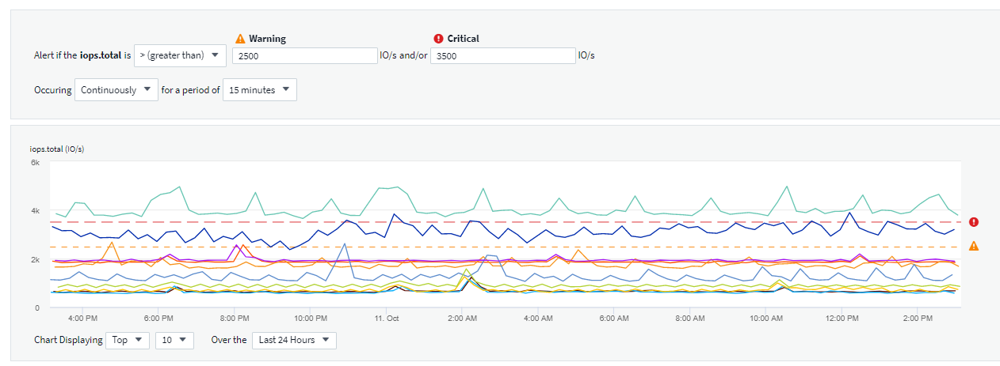
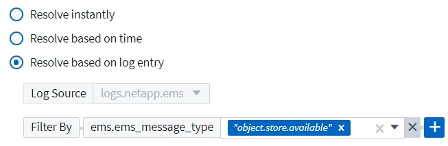

= モニタとのアラート
:toc: macro
:hardbreaks:
:toclevels: 1
:toc: 
:toclevels: 1
:nofooter: 
:icons: font
:linkattrs: 
:imagesdir: ./media/
:toc-position: content

[role="lead"]
監視を作成して、ネットワーク内のリソースに関連する問題についてユーザに通知するアラートをトリガーするしきい値を設定します。たとえば、多数のプロトコルのいずれかに対して _node write latency _ に対してアラートを送信するモニタを作成できます。

TIP: モニタとアラートは、 Cloud Insights Standard Edition 以降で使用できます。

toc::[]
監視を使用すると、ストレージ、 VM 、 EC2 、ポートなどの「インフラ」オブジェクトによって生成される指標や、 Kubernetes 、 ONTAP の高度な指標、 Telegraf プラグイン用に収集されたデータなどの「統合」データに対してしきい値を設定できます。これらの _ は、警告レベルまたは重大レベルのしきい値を超えたときにアラートを監視します。

また、警告レベル、重大レベル、または情報レベルのアラートをトリガーするモニタを作成して、指定された _ ログイベント _ が検出されたときに生成することもできます。

Cloud Insights には、いくつかの機能があります link:task_system_monitors.html["システム定義のモニター"] また、環境に応じて異なります。

== メトリックまたはログモニタ

. Cloud Insights メニューで、 * Alerts > Manage Monitors * をクリックします
+
[ モニタ ] リストページが表示され、現在設定されているモニタが表示されます。

. 既存のモニタを変更するには、リストでモニタ名をクリックします。
. モニタを追加するには、 *+ モニタ * をクリックします。
+
image:Monitor_log_or_metric.png["システムモニタまたはログモニタを選択します"]

+
新しいモニタを追加すると、メトリックモニタまたはログモニタを作成するよう求められます。

+
** _Metric _ は、インフラまたはパフォーマンスに関連するトリガーに関するアラートを監視します
** ログ関連のアクティビティに関するアラートを監視します

+
モニタタイプを選択すると、モニタ設定ダイアログが表示されます。構成は、作成するモニタのタイプによって異なります。

=== メートル法モニタ（ Metric Monitor

. ドロップダウンで、監視するオブジェクトタイプと指標を検索して選択します。

フィルタを設定して、監視するオブジェクトの属性や指標を絞り込むことができます。

image:MonitorMetricFilter.png["メトリックフィルタリング"]

統合データ（ Kubernetes 、 ONTAP 高度なデータなど）を使用する場合、指標フィルタリングを使用すると、データ系列の集計値でフィルタが機能し、グラフからオブジェクト全体が削除されるのとは異なり、プロットされたデータ系列から個々のデータポイントや一致しないデータポイントが削除されます。

TIP: 複数条件のモニタ（ IOPS > X 、レイテンシ > Y など）を作成するには、最初の条件をしきい値、 2 番目の条件をフィルタとして定義します。

===== モニターの条件を定義します。

. 監視するオブジェクトと指標を選択したら、警告レベルと重大レベルのしきい値、またはその両方を設定します。
. _Warning_level には、この例に 200 を入力します。この警告レベルを示す破線がグラフの例に表示されます。
. _Critical_level の場合は、 400 と入力します。このクリティカルレベルを示す破線がグラフの例に表示されます。
+
このグラフには履歴データが表示されます。グラフ上の警告および重大レベルの線はモニタを視覚的に表しているため、モニタがアラートをトリガーするタイミングを簡単に確認できます。

. 実行間隔には、 _15 分 _ の間で _Continuously_ を選択します。
+
しきい値を超えた時点でアラートをトリガーするか、しきい値が一定期間継続して違反になるまでアラートをトリガーするかを選択できます。この例では、合計 IOPS が警告レベルまたは重大レベルを超えるたびにアラートを表示する必要はありませんが、監視対象のオブジェクトがこれらのレベルの 1 つを 15 分以上継続して超えた場合にのみアラートを表示します。

+

=== ログモニタ

*Log monitor * を作成する場合は、まず使用可能なログリストから、監視するログを選択します。次に、前述のように使用可能な属性に基づいてフィルタできます。

たとえば、 logs.netapp.ems ソースで「 object.stor.unavailable 」というメッセージタイプをフィルタリングするように選択できます。

NOTE: ログモニタフィルタを空にすることはできません。

image:Monitor_log_monitor_filter.png["監視するログを選択し、フィルタを設定します"]

==== アラートの動作を定義します

ログアラートがトリガーされたときのアラートの送信方法を選択します。上で設定したフィルタ条件に基づいて、 _Warning_ 、 _Critical_ 、または _Informational_severity でアラートを生成するようにモニタを設定できます。

image:Monitor_log_alert_behavior.png["監視するログ動作を定義します"]

==== アラート解決の動作を定義します

ログ監視アラートの解決方法を選択できます。次の 3 つの選択肢があります。

* * 即時解決 * ：このアラートは、対処不要で即座に解決されます
* * 時間に基づく解決 * ：アラートは指定した時間が経過すると解決されます
* * ログエントリに基づいて解決 * ：このアラートは、後続のログアクティビティが発生すると解決されます。たとえば、あるオブジェクトが「 available 」としてログされる場合などです。

=== 通知タイプと受信者を選択します

[ チーム通知の設定 ] セクションでは、電子メールと Webhook のどちらでチームに通知するかを選択できます。

image:Webhook_Choose_Monitor_Notification.png["アラート方法を選択します"]

* 電子メールによる警告 :*

アラート通知の E メール受信者を指定します。必要に応じて、警告または重大なアラートの受信者を別々に選択することもできます。

image:email_monitor_alerts.png["E メールアラートの受信者"]

* Webhook による警告 :*

アラート通知に使用する Web フックを指定します。必要に応じて、警告または重大なアラートに別のフックを選択できます。

image:Webhook_Monitor_Notifications.png["Webhook Alerting ( ウェブフック警告"]

=== 対処方法または追加情報を設定しています

オプションの概要を追加したり、追加のインサイトや修正アクションを追加したりするには、「 * アラート概要の追加 * 」セクションに入力します。概要は 1024 文字以内で指定し、アラートとともに送信されます。分析情報 / 対処方法のフィールドは最大 67,000 文字で、アラートランディングページの概要セクションに表示されます。

これらのフィールドには、アラートを修正したり対処したりするためのメモ、リンク、手順を入力できます。

image:Monitors_Alert_Description.png["アラートの対処方法と概要"]

=== モニタを保存します

. 必要に応じて、モニタの概要を追加できます。
. モニターにわかりやすい名前を付け、 * 保存 * をクリックします。
+
新しいモニタがアクティブなモニタのリストに追加されます。

== 監視リスト

[Monitor] ページには、現在設定されているモニタが一覧表示され、次の情報が示されます

* モニタ名
* ステータス
* 監視対象のオブジェクト / 指標
* モニタの状態

モニターの右側にあるメニューをクリックし、 * 一時停止 * を選択すると、オブジェクトタイプの監視を一時的に停止できます。モニタリングを再開する準備ができたら、 * Resume * （続行）をクリックします。

モニタをコピーするには、メニューから「 * Duplicate （複製） * 」を選択します。その後、新しいモニタを変更して、オブジェクト / 指標、フィルタ、条件、 E メール受信者などを変更できます

モニタが不要になった場合は、メニューから * Delete * を選択して削除できます。

== グループを監視します

グループ化により、関連するモニタを表示および管理できます。たとえば、環境内のストレージ専用の監視グループを使用したり、特定の受信者リストに関連する監視を使用したりできます。

image:Monitors_GroupList.png["グループ化を監視します"]

次のモニタグループが表示されます。グループ名の横には、グループに含まれるモニタの数が表示されます。

* * すべてのモニタ * にすべてのモニタが一覧表示されます。
* * カスタムモニター * には、ユーザーが作成したすべてのモニターが一覧表示されます。
* * サスペンドされたモニタ * には、 Cloud Insights によってサスペンドされたすべてのシステムモニタが表示されます。
* Cloud Insights には、いくつかの * システム・モニター・グループ * が表示されます。このグループには、の 1 つ以上のグループが表示されます link:task_system_monitors.html["システム定義のモニタ"]ONTAP インフラストラクチャおよびワークロードモニタを含む。

NOTE: カスタムモニタは、一時停止、再開、削除、または別のグループへの移動が可能です。システム定義のモニタは一時停止および再開できますが、削除または移動することはできません。

=== 一時停止したモニタ

このグループは、 Cloud Insights が 1 つ以上のモニタを一時停止している場合にのみ表示されます。モニタが過度のアラートまたは継続的なアラートを生成している場合、モニタが一時停止することがあります。モニタがカスタムモニタの場合は、継続的なアラートの発生を防止する条件を変更してから、モニタを再開します。問題 がサスペンションを引き起こしている状態が解消されると、モニタはサスペンド状態のモニタグループから削除されます。

=== システム定義のモニター

これらのグループには、モニタに必要なデバイスやログが環境に含まれている限り、 Cloud Insights が提供するモニタが表示されます。

システム定義のモニタは、変更、別のグループへの移動、または削除できません。ただし、システムモニタを複製して、複製を変更または移動することはできます。

システムモニタには、 ONTAP インフラストラクチャ（ストレージ、ボリュームなど）のモニタ、ワークロード（ログモニタなど）、またはその他のグループが含まれます。ネットアップでは、お客様のニーズと製品の機能を常に評価しており、必要に応じてシステムの監視やグループの更新や追加を行います。

=== カスタムモニタグループ

必要に応じてモニタを含めるための独自のグループを作成できます。たとえば、すべてのストレージ関連モニタのグループを作成する場合などです。

新しいカスタムモニタグループを作成するには、「 + 」「新規モニタグループの作成 * 」ボタンをクリックします。グループの名前を入力し、 * グループの作成 * をクリックします。空のグループがその名前で作成されます。

モニタをグループに追加するには、 _all Monitors グループ（推奨）に移動し、次のいずれかの操作を行います。

* 単一のモニタを追加するには、モニタの右側にあるメニューをクリックし、 _ グループに追加 _ を選択します。モニタを追加するグループを選択します。
* モニタ名をクリックしてモニタの編集ビューを開き '_Associate to a monitor group_ セクションでグループを選択します
+
image:Monitors_AssociateToGroup.png["グループに関連付けます"]

モニタを削除するには、グループをクリックし、メニューから「 _ グループから削除」を選択します。モニタを _all Monitors _ または _Custom Monitors _ グループから削除することはできませんこれらのグループからモニタを削除するには、モニタ自体を削除する必要があります。

NOTE: グループからモニタを削除しても、モニタは Cloud Insights から削除されません。モニタを完全に削除するには、モニタを選択し、 _Delete_( 削除 ) をクリックします。これにより、その所有者であるグループからも削除され、どのユーザからも使用できなくなります。

同様にモニタを別のグループに移動するには '_Move to Group_ を選択します

グループ内のすべてのモニタを一度に一時停止または再開するには、グループのメニューを選択し、 _Pause_or_Resume_を クリックします。

同じメニューを使用して、グループの名前変更または削除を行います。グループを削除しても、 Cloud Insights からモニタは削除されません。これらのモニタは、 _ALL Monitors で使用できます。

image:Monitors_PauseGroup.png["グループを一時停止します"]

デフォルトでは 2 つのグループが表示されます。

* * すべてのモニタ * にすべてのモニタが一覧表示されます。
* * カスタムモニター * には、ユーザーが作成したモニターのみが表示されます。
* * サスペンド状態のモニタ * は、システムによってモニタがサスペンドされている場合にのみ表示されます。

== システム定義のモニター

Cloud Insights には、指標とログの両方を監視するシステム定義のモニタが多数含まれています。使用可能なシステムモニタは、環境内にあるデータコレクタによって異なります。そのため、 Cloud Insights で使用できるモニタは、データコレクタが追加されたり、設定が変更されたりすると変更される可能性があります。

を表示します link:task_system_monitors.html["システム定義のモニター"] Cloud Insights に含まれるモニタの説明については、ページを参照してください。

=== 詳細情報

* link:task_view_and_manage_alerts.html["アラートの表示と非表示"]

