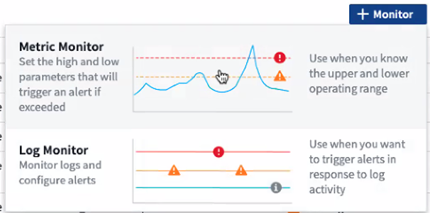
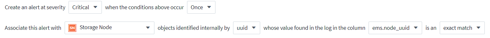

= モニタとのアラート

[role="lead"]
監視を作成して、ネットワーク内のリソースに関連する問題についてユーザに通知するアラートをトリガーするしきい値を設定します。たとえば、多数のプロトコルのいずれかに対して _node write latency _ に対してアラートを送信するモニタを作成できます。

TIP: モニタとアラートは、 Cloud Insights Standard Edition 以降で使用できます。

監視対象のしきい値と条件に達したとき、またはしきい値を超えたときに、 Cloud Insights はアラートを作成します。モニタには、 _Warning_threshold 、 a_Critical_threshold 、またはその両方を指定できます。

監視を使用すると、ストレージ、 VM 、 EC2 、ポートなどの「インフラ」オブジェクトや、 Kubernetes 、 ONTAP の高度な指標、 Telegraf プラグイン用に収集された統合データなどの「インフラ」オブジェクトにしきい値を設定できます。しきい値を超えたときにアラートを監視し、警告レベルのアラート、重大レベルのアラート、またはその両方のしきい値を設定できます。

については以下を参照してください link:#system-defined-monitors-preview["システム定義のモニター"] ドキュメントをプレビュー

=== モニタの作成

次の例では、 _Volume Node NFS Write Latency _reaches or exceeds 200ms 、および 400ms に達したか超えると Critical アラートを通知する監視を作成します。いずれかのしきい値を 15 分以上連続して超えた場合にのみ、アラートを表示する必要があります。

==== 要件

* 統合データを収集し、そのデータを収集するように Cloud Insights を設定する必要があります。

==== モニタを作成します

. Cloud Insights メニューで、 * Alerts > Manage Monitors * をクリックします
+
[ モニタ ] リストページが表示され、現在設定されているモニタが表示されます。

. モニタを追加するには、 *+ モニタ * をクリックします。既存のモニタを変更するには、リストでモニタ名をクリックします。
+
Monitor Configuration （モニタ設定）ダイアログが表示されます。

. ドロップダウンで、監視するオブジェクトのタイプと指標を検索して選択します。例： _NetApp_ONTAP_volume_node_name _nfs_write_latency _ 。

フィルタを設定して、監視するオブジェクトの属性や指標を絞り込むことができます。

image:MonitorMetricFilter.png["メトリックフィルタリング"]

統合データ（ Kubernetes 、 ONTAP 高度なデータなど）を使用する場合、指標フィルタリングを使用すると、データ系列の集計値でフィルタが機能し、グラフからオブジェクト全体が削除されるのとは異なり、プロットされたデータ系列から個々のデータポイントや一致しないデータポイントが削除されます。

TIP: 複数条件のモニタ（ IOPS > X 、レイテンシ > Y など）を作成するには、最初の条件をしきい値、 2 番目の条件をフィルタとして定義します。

==== モニターの条件を定義します。

. 監視するオブジェクトと指標を選択したら、警告レベルと重大レベルのしきい値、またはその両方を設定します。
. _Warning_level には、 200 を入力します。この警告レベルを示す破線がグラフの例に表示されます。
. _Critical_level の場合は、 400 と入力します。このクリティカルレベルを示す破線がグラフの例に表示されます。
+
このグラフには履歴データが表示されます。グラフ上の警告および重大レベルの線はモニタを視覚的に表しているため、モニタがアラートをトリガーするタイミングを簡単に確認できます。

. 実行間隔には、 _15 分 _ の間で _Continuously_ を選択します。
+
しきい値を超えた時点でアラートをトリガーするか、しきい値が一定期間継続して違反になるまでアラートをトリガーするかを選択できます。この例では、合計 IOPS が警告レベルまたは重大レベルを超えるたびにアラートを表示する必要はありませんが、監視対象のオブジェクトがこれらのレベルの 1 つを 15 分以上継続して超えた場合にのみアラートを表示します。

+
image:define_monitor_conditions.png["条件を定義します"]

==== フィルタを調整しています

フィルタ処理中に、入力を開始すると、現在のテキストに基づいて * ワイルドカードフィルタ * を作成するオプションが表示されます。このオプションを選択すると、ワイルドカード式に一致するすべての結果が返されます。また、 NOT または OR を使用して *expressions * を作成することもできます。また、「 None 」オプションを選択して、フィールドで null 値をフィルタリングすることもできます。

image:Type-Ahead_Monitor_1.png["ワイルドカードフィルタ"]

ワイルドカードまたは式に基づくフィルタ（例 フィルタフィールドに濃い青で表示されます。リストから直接選択した項目は、水色で表示されます。

image:Type-Ahead-Example-Wildcard-DirectSelect.png["ワイルドカードフィルタの結果"]

ワイルドカードおよび式フィルタリングは、テキストまたはリストでは機能しますが、数値、日付、またはブール値では機能しません。

=== 対処方法または追加情報を設定しています

オプションの概要を追加したり、追加のインサイトや修正アクションを追加したりするには、「 * アラート概要の追加 * 」セクションに入力します。概要は 1024 文字以内で指定し、アラートとともに送信されます。分析情報 / 対処方法のフィールドは最大 67,000 文字で、アラートランディングページの概要セクションに表示されます。

これらのフィールドには、アラートを修正したり対処したりするためのメモ、リンク、手順を入力できます。

image:Monitors_Alert_Description.png["アラートの対処方法と概要"]

=== 通知タイプと受信者を選択します

[ チーム通知の設定 ] セクションでは、電子メールと Webhook のどちらでチームに通知するかを選択できます。

image:Webhook_Choose_Monitor_Notification.png["アラート方法を選択します"]

* 電子メールによる警告 :*

アラート通知の E メール受信者を指定します。必要に応じて、警告または重大なアラートの受信者を別々に選択することもできます。

image:email_monitor_alerts.png["E メールアラートの受信者"]

* Webhook による警告 :*

アラート通知に使用する Web フックを指定します。必要に応じて、警告または重大なアラートに別のフックを選択できます。

image:Webhook_Monitor_Notifications.png["Webhook Alerting ( ウェブフック警告"]

=== モニタを保存します

. 必要に応じて、モニタの概要を追加できます。
. モニターにわかりやすい名前を付け、 * 保存 * をクリックします。
+
新しいモニタがアクティブなモニタのリストに追加されます。

=== 監視リスト

[Monitor] ページには、現在設定されているモニタが一覧表示され、次の情報が示されます

* モニタ名
* ステータス
* 監視対象のオブジェクト / 指標
* モニタの状態

モニタ名の横にある「ベル」アイコンをクリックすると、モニタに関連付けられているアクティブなアラートを表示できます。image:ViewActiveAlerts.png["モニタのアクティブなアラートを示すアイコン"]

モニターの右側にあるメニューをクリックし、 * 一時停止 * を選択すると、オブジェクトタイプの監視を一時的に停止できます。モニタリングを再開する準備ができたら、 * Resume * （続行）をクリックします。

モニタをコピーするには、メニューから「 * Duplicate （複製） * 」を選択します。その後、新しいモニタを変更して、オブジェクト / 指標、フィルタ、条件、 E メール受信者などを変更できます

モニタが不要になった場合は、メニューから * Delete * を選択して削除できます。

== グループを監視します

グループ化により、関連するモニタを表示および管理できます。たとえば、環境内のストレージ専用の監視グループを使用したり、特定の受信者リストに関連する監視を使用したりできます。

image:Monitors_GroupList.png["グループ化を監視します"]

グループ名の横には、グループに含まれるモニタの数が表示されます。

新しいグループを作成するには、 [*"+" Create New Monitor Group*] ボタンをクリックします。グループの名前を入力し、 * グループの作成 * をクリックします。空のグループがその名前で作成されます。

モニタをグループに追加するには、 _all Monitors グループ（推奨）に移動し、次のいずれかの操作を行います。

* 単一のモニタを追加するには、モニタの右側にあるメニューをクリックし、 _ グループに追加 _ を選択します。モニタを追加するグループを選択します。
* モニタ名をクリックしてモニタの編集ビューを開き '_Associate to a monitor group_ セクションでグループを選択します
+
image:Monitors_AssociateToGroup.png["グループに関連付けます"]

モニタを削除するには、グループをクリックし、メニューから「 _ グループから削除」を選択します。モニタを _all Monitors _ または _Custom Monitors _ グループから削除することはできませんこれらのグループからモニタを削除するには、モニタ自体を削除する必要があります。

NOTE: グループからモニタを削除しても、モニタは Cloud Insights から削除されません。モニタを完全に削除するには、モニタを選択し、 _Delete_( 削除 ) をクリックします。これにより、その所有者であるグループからも削除され、どのユーザからも使用できなくなります。

同様にモニタを別のグループに移動するには '_Move to Group_ を選択します

NOTE: 各モニタは、一度に 1 つのグループにしか所属できません。

グループ内のすべてのモニタを一度に一時停止または再開するには、グループのメニューを選択し、 _Pause_or_Resume_を クリックします。

同じメニューを使用して、グループの名前変更または削除を行います。グループを削除しても、 Cloud Insights からモニタは削除されません。これらのモニタは、 _ALL Monitors で使用できます。

image:Monitors_PauseGroup.png["グループを一時停止します"]

== システム定義モニタ（プレビュー）

2021 年 10 月から、 Cloud Insights は指標とログの両方についてシステム定義のモニタを多数プレビューします。モニタインタフェースには、これらのシステムモニタに対応するためのいくつかの変更が含まれます。これらについては、このセクションで説明します。

NOTE: システム定義モニタはプレビュー機能であるため、変更されることがあります。

==== モニタを作成します

. Cloud Insights メニューで、 * Alerts > Manage Monitors * をクリックします
+
[ モニタ ] リストページが表示され、現在設定されているモニタが表示されます。

. 既存のモニタを変更するには、リストでモニタ名をクリックします。
. モニタを追加するには、 *+ モニタ * をクリックします。
+

+
新しいモニタを追加すると、メトリックモニタまたはログモニタを作成するよう求められます。

+
** _Metric _ は、インフラまたはパフォーマンスに関連するトリガーに関するアラートを監視します
** ログ関連のアクティビティに関するアラートを監視します

+
モニタタイプを選択すると、モニタ設定ダイアログが表示されます。

=== メートル法モニタ（ Metric Monitor

. ドロップダウンで、監視するオブジェクトタイプと指標を検索して選択します。

フィルタを設定して、監視するオブジェクトの属性や指標を絞り込むことができます。

image:MonitorMetricFilter.png["メトリックフィルタリング"]

統合データ（ Kubernetes 、 ONTAP 高度なデータなど）を使用する場合、指標フィルタリングを使用すると、データ系列の集計値でフィルタが機能し、グラフからオブジェクト全体が削除されるのとは異なり、プロットされたデータ系列から個々のデータポイントや一致しないデータポイントが削除されます。

TIP: 複数条件のモニタ（ IOPS > X 、レイテンシ > Y など）を作成するには、最初の条件をしきい値、 2 番目の条件をフィルタとして定義します。

==== モニターの条件を定義します。

. 監視するオブジェクトと指標を選択したら、警告レベルと重大レベルのしきい値、またはその両方を設定します。
. _Warning_level には、この例に 200 を入力します。この警告レベルを示す破線がグラフの例に表示されます。
. _Critical_level の場合は、 400 と入力します。このクリティカルレベルを示す破線がグラフの例に表示されます。
+
このグラフには履歴データが表示されます。グラフ上の警告および重大レベルの線はモニタを視覚的に表しているため、モニタがアラートをトリガーするタイミングを簡単に確認できます。

. 実行間隔には、 _15 分 _ の間で _Continuously_ を選択します。
+
しきい値を超えた時点でアラートをトリガーするか、しきい値が一定期間継続して違反になるまでアラートをトリガーするかを選択できます。この例では、合計 IOPS が警告レベルまたは重大レベルを超えるたびにアラートを表示する必要はありませんが、監視対象のオブジェクトがこれらのレベルの 1 つを 15 分以上継続して超えた場合にのみアラートを表示します。

+
image:Monitor_metric_conditions.png["モニタの条件を定義します"]

=== ログモニタ

*Log monitor * で、最初に使用可能なログリストから監視するログを選択します。次に、前述のように使用可能な属性に基づいてフィルタできます。

たとえば、 logs.netapp.ems ソースの「 object.stor.unavailabe 」メッセージタイプをフィルタリングするように選択できます。

NOTE: ログモニタフィルタを空にすることはできません。

image:Monitor_log_monitor_filter.png["監視するログを選択し、フィルタを設定します"]

==== アラートの動作を定義します

ログアラートがトリガーされたときのアラートの送信方法を選択します。上で設定したフィルタ条件に基づいて、 _Warning_ 、 _Critical_ 、または _Informational_severity でアラートを生成するようにモニタを設定できます。

==== アラート解決の動作を定義します

ログ監視アラートの解決方法を選択できます。次の 3 つの選択肢があります。

* * 即時解決 * ：このアラートは、対処不要で即座に解決されます
* * 時間に基づく解決 * ：アラートは指定した時間が経過すると解決されます
* * ログエントリに基づいて解決 * ：このアラートは、後続のログアクティビティが発生すると解決されます。たとえば、あるオブジェクトが「 available 」としてログされる場合などです。

image:Monitor_log_monitor_resolution.png["アラート解決"]

==== 通知タイプと受信者を選択します

[ チーム通知の設定 ] セクションでは、電子メールと Webhook のどちらでチームに通知するかを選択できます。

image:Webhook_Choose_Monitor_Notification.png["アラート方法を選択します"]

* 電子メールによる警告 :*

アラート通知の E メール受信者を指定します。必要に応じて、警告または重大なアラートの受信者を別々に選択することもできます。

image:email_monitor_alerts.png["E メールアラートの受信者"]

* Webhook による警告 :*

アラート通知に使用する Web フックを指定します。必要に応じて、警告または重大なアラートに別のフックを選択できます。

image:Webhook_Monitor_Notifications.png["Webhook Alerting ( ウェブフック警告"]

NOTE: Webhook はプレビュー機能と見なされるため、変更される場合があります。

=== 対処方法または追加情報を設定しています

オプションの概要を追加したり、追加のインサイトや修正アクションを追加したりするには、「 * アラート概要の追加 * 」セクションに入力します。概要は 1024 文字以内で指定し、アラートとともに送信されます。分析情報 / 対処方法のフィールドは最大 67,000 文字で、アラートランディングページの概要セクションに表示されます。

これらのフィールドには、アラートを修正したり対処したりするためのメモ、リンク、手順を入力できます。

image:Monitors_Alert_Description.png["アラートの対処方法と概要"]

=== モニタを保存します

. 必要に応じて、モニタの概要を追加できます。
. モニターにわかりやすい名前を付け、 * 保存 * をクリックします。
+
新しいモニタがアクティブなモニタのリストに追加されます。

=== 監視リスト

[Monitor] ページには、現在設定されているモニタが一覧表示され、次の情報が示されます

* モニタ名
* ステータス
* 監視対象のオブジェクト / 指標
* モニタの状態

モニターの右側にあるメニューをクリックし、 * 一時停止 * を選択すると、オブジェクトタイプの監視を一時的に停止できます。モニタリングを再開する準備ができたら、 * Resume * （続行）をクリックします。

モニタをコピーするには、メニューから「 * Duplicate （複製） * 」を選択します。その後、新しいモニタを変更して、オブジェクト / 指標、フィルタ、条件、 E メール受信者などを変更できます

モニタが不要になった場合は、メニューから * Delete * を選択して削除できます。

== グループを監視します

グループ化により、関連するモニタを表示および管理できます。たとえば、環境内のストレージ専用の監視グループを使用したり、特定の受信者リストに関連する監視を使用したりできます。

image:Monitors_GroupList.png["グループ化を監視します"]

グループ名の横には、グループに含まれるモニタの数が表示されます。

NOTE: カスタムモニタは、一時停止、再開、削除、または別のグループへの移動が可能です。システム定義のモニタは一時停止および再開できますが、削除または移動することはできません。

=== カスタムモニタグループ

新しいカスタムモニタグループを作成するには、「 + 」「新規モニタグループの作成 * 」ボタンをクリックします。グループの名前を入力し、 * グループの作成 * をクリックします。空のグループがその名前で作成されます。

モニタをグループに追加するには、 _all Monitors グループ（推奨）に移動し、次のいずれかの操作を行います。

* 単一のモニタを追加するには、モニタの右側にあるメニューをクリックし、 _ グループに追加 _ を選択します。モニタを追加するグループを選択します。
* モニタ名をクリックしてモニタの編集ビューを開き '_Associate to a monitor group_ セクションでグループを選択します
+
image:Monitors_AssociateToGroup.png["グループに関連付けます"]

モニタを削除するには、グループをクリックし、メニューから「 _ グループから削除」を選択します。モニタを _all Monitors _ または _Custom Monitors _ グループから削除することはできませんこれらのグループからモニタを削除するには、モニタ自体を削除する必要があります。

NOTE: グループからモニタを削除しても、モニタは Cloud Insights から削除されません。モニタを完全に削除するには、モニタを選択し、 _Delete_( 削除 ) をクリックします。これにより、その所有者であるグループからも削除され、どのユーザからも使用できなくなります。

同様にモニタを別のグループに移動するには '_Move to Group_ を選択します

NOTE: 各モニタは、一度に 1 つのグループのみに属することができます（「すべてのモニタ」および「カスタムモニタ」に属することもあります）。

グループ内のすべてのモニタを一度に一時停止または再開するには、グループのメニューを選択し、 _Pause_or_Resume_を クリックします。

同じメニューを使用して、グループの名前変更または削除を行います。グループを削除しても、 Cloud Insights からモニタは削除されません。これらのモニタは、 _ALL Monitors で使用できます。

image:Monitors_PauseGroup.png["グループを一時停止します"]

=== システム定義のモニター

システム定義のモニタは、事前に定義されたメトリックと条件に加えて、デフォルトの説明と修正アクションで構成されています。これらは変更できません。システム定義モニタの通知受信者リストを変更できます。メトリック、条件、概要、および修正アクションを表示したり、受信者リストを変更したりするには、システム定義のモニタグループを開き、リスト内のモニタ名をクリックします。

システム定義のモニタグループは変更または削除できません。

以下のシステム定義モニタは、記載されたグループで使用できます。

* * ONTAP インフラストラクチャ * は、 ONTAP クラスタのインフラストラクチャ関連の問題を監視します。
* * ONTAP ワークロードの例 * には、ワークロード関連の問題のモニターが含まれています。
* 両方のグループのモニタのデフォルトは _Paused _ state です。

|===

| モニタ名 | 重大度 | 概要を監視します | 対処方法 

| WAFL クォータの qtree を超えました | 情報 | このイベントは、ボリュームでツリークォータを超えた場合に発生します。このイベントは、一定時間、または「クォータのサイズ変更」が実行されるまで、このツリーに対して繰り返されることはありません。時間は、「 quota logmsg 」コマンドで指定します。 | このツリーで使用量を減らすか、クォータを増やしてから、「 quota resize 」コマンドを実行してください。 

| ボリュームの自動サイズ変更に成功しました | 情報 | " このイベントは、ボリュームの自動サイズ変更が成功した場合に発生します。これは、「 autosize grow 」オプションを有効にし、ボリュームが grow しきい値に達した場合に発生します。 | なし 

| ボリュームの自動サイズ変更に失敗しました | 警告 | ボリュームの自動サイズ変更に失敗しました。対処しないと、ボリュームのスペースが不足する可能性があります。 | ボリュームの自動サイズ変更が失敗した理由を分析します。ボリュームが最大容量に達したか。ストレージプール（アグリゲート）のスペースが不足していないか。ボリュームのサイズを自動的に変更するときに、ボリュームの最大容量を拡張します。 

| SnapMirror 関係が同期されていません | 重要 | このイベントは、 SnapMirror （ R ） Sync 関係のステータスが「 in-sync 」から「 out-of-sync 」に変わると発生します。レプリケーションモードに基づいて、ソースボリュームで I/O が制限されます。「 strict-sync-mirror 」ポリシータイプの関係では、ボリュームへのクライアントの読み取りまたは書き込みアクセスは許可されません。データ保護に影響します。 | ソースボリュームとデスティネーションボリュームの間のネットワーク接続を確認します。「 snapmirror show 」コマンドを使用して、 SnapMirror Sync 関係のステータスを監視します。「自動再同期」では、関係のステータスが「同期中」に戻ります。 

| SAN の「アクティブ / アクティブ」状態が変更されました | 警告 | 「 SAN パスは対称ではなくなりました。AFF と FAS はどちらも非対称であるため、パスは ASA でのみ非対称にする必要があります。」 | 「アクティブ / アクティブ」状態を試してから有効にしてください。問題が解決しない場合は、カスタマーサポートにお問い合わせください。」 

| QoS 監視メモリの最大化 | 重要 | QoS サブシステムの動的メモリが現在のプラットフォームハードウェアの上限に達しました。一部の QoS 機能は、制限された容量で動作する場合があります。 | " 一部のアクティブなワークロードまたはストリームを削除してメモリを解放します。「 statistics show -object workload -counter ops 」コマンドを使用して、アクティブなワークロードを確認します。アクティブなワークロードに対する処理がゼロ以外の処理を示しています。その後、「 workload delete <workloads name> 」コマンドを複数回使用して特定のワークロードを削除してください。また、「 tream delete -workload <workload name> * 」コマンドを使用して、アクティブなワークロードから関連付けられたストリームを削除することもできます。 

| NVMe ネームスペースはオンラインです | 情報 | このイベントは、 NVMe ネームスペースを手動でオンラインにした場合に発生します。 | なし 

| NVMe ネームスペースはオフラインです | 情報 | このイベントは、 NVMe ネームスペースが手動でオフラインになった場合に発生します。 | なし 

| NVMe ネームスペースが破棄されました | 情報 | NVMe ネームスペースが破棄されたときに発生します。 | なし 

| 応答しないアンチウイルスサーバー | 情報 | ONTAP （ R ）が応答しない AV サーバを検出して強制的に Vscan 接続を閉じた場合に発生します。 | AV コネクタに設置されている AV サーバが Storage Virtual Machine （ SVM ）に接続してスキャン要求を受信できることを確認してください。 

| LUN が破棄されました | 情報 | LUN が破棄されたときに発生します。 | なし 

| FC ターゲットポートのコマンドを超過しました | 警告 | 物理 FC ターゲットポートで未処理のコマンド数が、サポートされている制限を超えています。未処理のコマンドを実行するための十分なバッファがポートにありません。イニシエータ I/O が過剰に使用しているため、オーバーランが発生しているか、ファンインが急すぎます。 | 次の対処策を実行します：「 1 」ポートのホストのファンインを評価し、次のいずれかの操作を実行します。 "a..."このポートにログインするホストの数を減らしてください。Bこのポートにログインするホストがアクセスする LUN の数を減らしてください。c.ホストコマンドのキュー深度を減らします。2.「 fcp_port 」 CM オブジェクトの「 queue_full 」カウンタを監視し、カウンタが増加しないことを確認します。たとえば、「 statistics show -object fcp_port -counter queue_full -instance port.portname - raw 3 」と入力します。しきい値カウンタを監視して、増加しないことを確認します。たとえば、 statistics show -object fcp_port -counter threshold_full-instance port.portname -raw と指定します 

| LUN はオフラインです | 情報 | このイベントは、 LUN が手動でオフラインになった場合に発生します。 | LUN をオンラインに戻します。 

| AWS クレデンシャルが初期化されて | 情報 | このイベントは、モジュールが初期化される前に、クラウドクレデンシャルスレッドから Amazon Web Services （ AWS ）の Identity and Access Management （ IAM ）ロールベースクレデンシャルにアクセスしようとした場合に発生します。 | " クラウドクレデンシャルのスレッドとシステムの初期化が完了するまで待ちます。" 

| クラウド階層に到達不能です | 重要 | ストレージノードからクラウド階層のオブジェクトストア API に接続することはできません。一部のデータにアクセスできません。 | 「社内製品を使用している場合は、以下の対応策を実施してください：」 1.「 network interface show 」コマンドを使用して、インタークラスタ LIF がオンラインで機能していることを確認します。 「 2.デスティネーションノードのクラスタ間 LIF で「 ping 」コマンドを使用して、オブジェクトストアサーバへのネットワーク接続を確認します。 3.次のことを確認してください。 a.オブジェクトストアの設定に変更はありません。Bログイン情報と接続情報は引き続き有効です。問題が解決しない場合は、ネットアップテクニカルサポートにお問い合わせください。Cloud Volumes ONTAP を使用している場合は、次の対処策を実施してください：「 1 」オブジェクトストアの設定が変更されていないことを確認します。2. ログイン情報と接続情報がまだ有効であることを確認します。問題が解決しない場合は、ネットアップテクニカルサポートにお問い合わせください。 

| FlexGroup コンスティチュエントの inode が不明です | 重要 | 「 FlexGroup ボリュームのコンスティチュエントの inode が不足しており、原因によってサービスが停止する可能性があります。この構成要素には新しいファイルを作成できません。これにより、 FlexGroup ボリューム間でコンテンツが全体的に不均衡な状態に分散される可能性があります。」 | 「 volume modify -files + X 」コマンドを使用して、 FlexGroup ボリュームに容量を追加することを推奨します。 " または、 FlexGroup ボリュームからファイルを削除します。しかし、どのファイルがコンスティチュエントに置かれているかを特定するのは難しい」 

| FlexGroup コンスティチュエントの inode がほぼなくなっています | 警告 | 「 FlexGroup ボリューム内のコンスティチュエントは inode がほとんどなくなっており、原因がサービスの停止を招く可能性があります。コンスティチュエントに平均よりも少ない作成要求が送信されます。FlexGroup ボリュームの全体的なパフォーマンスに影響することがあります。これは、 inode が多いコンスティチュエントに要求がルーティングされるためです。」 | 「 volume modify -files + X 」コマンドを使用して、 FlexGroup ボリュームに容量を追加することを推奨します。 " または、 FlexGroup ボリュームからファイルを削除します。しかし、どのファイルがコンスティチュエントに置かれているかを特定するのは難しい」 

| FlexGroup 構成要素がフルです | 重要 | 「 FlexGroup ボリューム内のコンスティチュエントがいっぱいになっているため、原因がサービスを停止する可能性があります。この場合も、 FlexGroup ボリュームでファイルを作成または拡張できます。ただし、コンスティチュエントに格納されているファイルを変更することはできません。その結果、 FlexGroup ボリュームに対して書き込み処理を実行しようとしたときに、ランダムなスペース不足エラーが発生することがあります。」 | 「 volume modify -files + X 」コマンドを使用して、 FlexGroup ボリュームに容量を追加することを推奨します。 " または、 FlexGroup ボリュームからファイルを削除します。しかし、どのファイルがコンスティチュエントに置かれているかを特定するのは難しい」 

| FlexGroup コンスティチュエントがほぼフルです | 警告 | 「 FlexGroup ボリューム内のコンスティチュエントのスペースがほとんどなくなると、原因によってサービスが停止する可能性があります。ファイルを作成して展開できます。ただし、コンスティチュエントのスペースが不足すると、コンスティチュエントにファイルを追加したり変更したりできなくなる可能性があります。" | 「 volume modify -files + X 」コマンドを使用して、 FlexGroup ボリュームに容量を追加することを推奨します。 " または、 FlexGroup ボリュームからファイルを削除します。しかし、どのファイルがコンスティチュエントに置かれているかを特定するのは難しい」 

| サービスプロセッサが設定されていません | 警告 | 「このイベントは毎週発生し、サービスプロセッサ（ SP ）の設定を通知するために使用されます。SP は、システムに組み込まれている物理デバイスであり、リモートアクセス機能とリモート管理機能を提供します。すべての機能を使用できるように SP を設定する必要があります。" | 次の対処策を実行します：「 1 」「 system service-processor network modify 」コマンドを使用して SP を設定します。 「 2.必要に応じて、「 system service-processor network show 」コマンドを使用して、 SP の MAC アドレスを取得します。 「 3.「 system service-processor network show 」コマンドを使用して、 SP のネットワーク設定を確認します。 「 4.「 system service-processor AutoSupport invoke 」コマンドを使用して、 SP が AutoSupport E メールを送信できることを確認します。 注 AutoSupport ：このコマンドを実行する前に、 ONTAP E メールホストと受信者を問題で設定する必要があります。 

| サービスプロセッサはオフラインです | 重要 | 「すべての SP リカバリアクションが実行されていても、 ONTAP はサービスプロセッサ（ SP ）からハートビートを受信しなくなりました。ONTAP では、 SP なしでハードウェアの健常性を監視できません。」 | 次の操作を実行して、システムの電源を再投入します。ハードウェアの損傷やデータの損失を防ぐため、システムはシャットダウンします。SP がオフラインになった場合にすぐに通知されるようにパニック・アラートを設定する1. コントローラをシャーシから引き出します。2. コントローラを元の状態に戻します。3. コントローラの電源を入れ直します。問題が解決しない場合は、コントローラモジュールを交換します。 

| 未割り当てディスク | 情報 | システムに未割り当てのディスクがあります - 容量が無駄になっており、構成の設定ミスや部分的な変更がシステムに適用されている可能性があります。 | 次の対処策を実行します：「 1 」「 disk show -n 」コマンドを使用して、割り当てられていないディスクを確認します。 「 2.「 disk assign 」コマンドを使用して、ディスクをシステムに割り当てます。 

| ファンの障害により、システムは動作できません | 重要 | 「 1 つまたは複数のメインユニットファンで障害が発生し、システムの動作が中断しました。これにより、データが失われる可能性があります。" | 障害が発生したファンを交換します。 

| ファンで障害が発生しまし | 警告 | 1 つ以上のメインユニットファンで障害が発生しました。システムは引き続き動作します。 | " 障害が発生したファンを取り付け直します。エラーが解消されない場合は、交換してください。 " しかし、この状態が長く続くと、過熱によって自動シャットダウンがトリガーされることがあります。 

| ファンが警告状態です | 情報 | このイベントは、 1 つ以上のファンが警告状態のときに発生します。 | 過熱を防ぐため、示されたファンを交換してください。 

| NVRAM バッテリ低下 | 警告 | NVRAM バッテリ容量が非常に少なくなっています。バッテリの電源が切れた場合、データが失われる可能性があります。 | 次の対処策を実行します。「 Your system Generates and Transmits an AutoSupport or "call home" 」というメッセージがネットアップテクニカルサポートと、設定されている送信先（該当する場合）に送信されます。AutoSupport メッセージが正常に配信されると、問題の特定と解決方法が大幅に改善されます。」 「 1.「 system node environment sensors show 」コマンドを使用して、バッテリの現在のステータス、容量、および充電状態を表示します。 「 2.最近バッテリを交換した場合、またはシステムが長時間動作しない場合は、バッテリを監視して、バッテリが正しく充電されていることを確認してください。」 「 3.バッテリが引き続きクリティカルなレベルを下回っている場合は、ネットアップテクニカルサポートに連絡してください。ストレージシステムは自動的にシャットダウンします。」 

| ディスクがサービスを停止しています | 情報 | 「このイベントは、ディスクが障害としてマークされているか、完全消去中であるか、 Maintenance Center に入力されたためにサービスから削除された場合に発生します。」 | なし 

| ストレージスイッチのファンに障害が発生しました | 重要 | " シェルフの冷却ファンまたはファンモジュールに障害が発生しました。シェルフ内のディスクに十分な通気による冷却が確保されないと、ディスク障害が発生する可能性があります。」 | 次の対処方法を実行します。 1.ファンモジュールが完全に装着され、固定されていることを確認します。メモ：一部のディスクシェルフの電源装置モジュールにファンが内蔵されています。2.問題が解消されない場合は、ファンモジュールを交換してください。」 「 3.それでも問題が解決されない場合は、ネットアップテクニカルサポートにお問い合わせください。」 
|===

=== 詳細情報

* link:task_view_and_manage_alerts.html["アラートの表示と非表示"]

